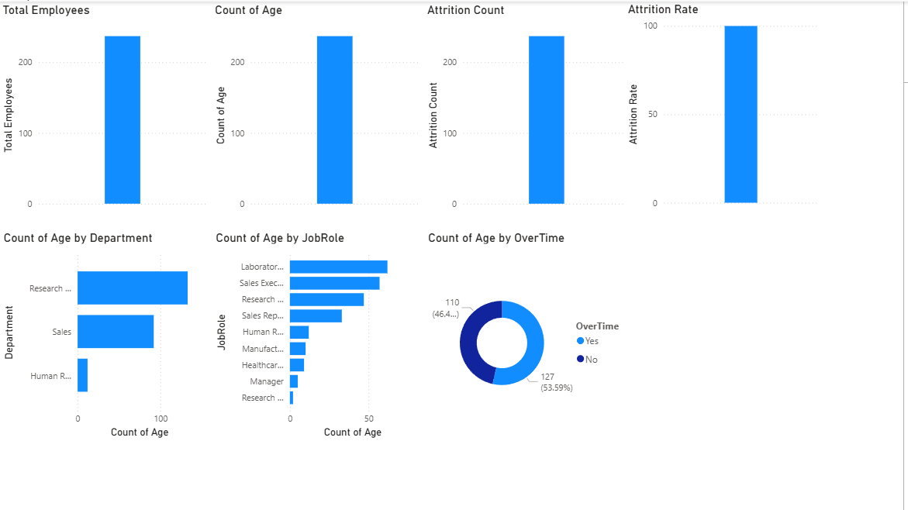

# IBM HR Analytics Dashboard

## 📖 Project Overview

This project analyzes employee data from IBM to understand the key factors influencing employee attrition. Using SQL, Python, and Power BI, the data was cleaned, explored, and visualized to help HR teams identify trends, improve employee retention, and support data-driven decision-making.

## 🎯 Business Problem

Employee attrition can increase recruitment costs, reduce productivity, and impact overall business performance. The HR department needs to understand which employees are more likely to leave and what factors contribute to higher attrition rates.

## ✅ Project Objectives

- Analyze employee attrition trends.
- Identify departments and job roles with high attrition.
- Compare attrition across age groups, gender, and education levels.
- Build an interactive Power BI dashboard for HR decision-making.
- Provide actionable business recommendations.

## 📂 Dataset Information

- Dataset: IBM HR Analytics Employee Attrition
- Source: Kaggle
- Records: 1,470 employees
- Columns: 35
- Target Variable: Attrition

## 🛠 Tools & Technologies

- SQL
- Python
- Pandas
- NumPy
- Matplotlib
- Power BI
- DAX
- Git
- GitHub

## 🧹 Data Cleaning

The dataset was cleaned using Python before analysis.

The following steps were performed:

- Checked for missing values
- Removed duplicate records
- Verified data types
- Standardized column names
- Validated categorical values
- Prepared the dataset for visualization and analysis

## 📊 Exploratory Data Analysis

The dataset was analyzed to understand employee characteristics and identify attrition patterns.

The analysis included:

- Employee distribution by department
- Attrition by job role
- Attrition by age group
- Monthly income distribution
- Years at company
- Job satisfaction analysis
- Gender-wise attrition

## 💾 SQL Analysis

SQL was used to explore employee data and answer business questions.

Examples of analysis:

- Total employees
- Overall attrition count
- Attrition by department
- Attrition by job role
- Average monthly income
- Employees by education level
- Average years at company
- Department-wise employee count

## 📈 Dashboard Preview



## 📌 Key KPIs

- Total Employees
- Attrition Count
- Attrition Rate
- Average Age
- Average Monthly Income
- Average Years at Company

## 🎛 Dashboard Features

The Power BI dashboard includes:

- KPI Cards
- Department-wise Attrition
- Job Role Analysis
- Age Group Analysis
- Gender Analysis
- Education Analysis
- Interactive Filters (Slicers)

## 💡 Key Business Insights

1. The Sales department has the highest employee attrition, indicating a need for better employee engagement and retention strategies.

2. Sales Representatives and Laboratory Technicians experience higher attrition than most other job roles.

3. Employees with lower monthly income tend to have a higher attrition rate.

4. Employees in the early years of their career are more likely to leave the company.

5. Employees reporting lower job satisfaction show a higher likelihood of attrition.

6. Most employees who leave are younger and have shorter tenure compared to long-serving employees.

## 🚀 Business Recommendations

- Improve onboarding programs for new employees to reduce early attrition.

- Review compensation and benefits for high-risk job roles.

- Conduct regular employee satisfaction surveys.

- Provide career growth opportunities and internal training programs.

- Strengthen manager feedback and employee recognition programs.

- Monitor departments with consistently high attrition using HR dashboards.

## 📁 Folder Structure

```text
IBM-HR-Analytics-Project/
│
├── data/
├── notebooks/
├── sql/
├── dashboard/
├── images/
├── docs/
├── README.md
├── requirements.txt
└── .gitignore
```

## ▶️ How to Run the Project

1. Clone this repository.
2. Open the Jupyter Notebook in the `notebooks` folder.
3. Install the required Python libraries.
4. Run the notebook to reproduce the analysis.
5. Open the Power BI (.pbix) file to explore the interactive dashboard.

## 🔮 Future Improvements

- Add predictive models to identify employees at risk of attrition.
- Automate data refresh using Power BI.
- Connect the dashboard to a live SQL database.
- Expand analysis with employee performance and attendance data.

## ⭐ Project Highlights

- Analyzed 1,470 employee records.
- Built an interactive Power BI dashboard.
- Performed data cleaning and EDA using Python.
- Applied SQL for business analysis.
- Generated actionable HR insights and recommendations.

## 👨‍💻 Author

**Manoj Kumar**

Aspiring Data Analyst

### Connect with me

- LinkedIn: *(https://www.linkedin.com/in/manoj-kumar-294033375/)*
- GitHub: *(https://github.com/manojkumar921721-bit/IBM-HR-Analytics-Project.git)*
